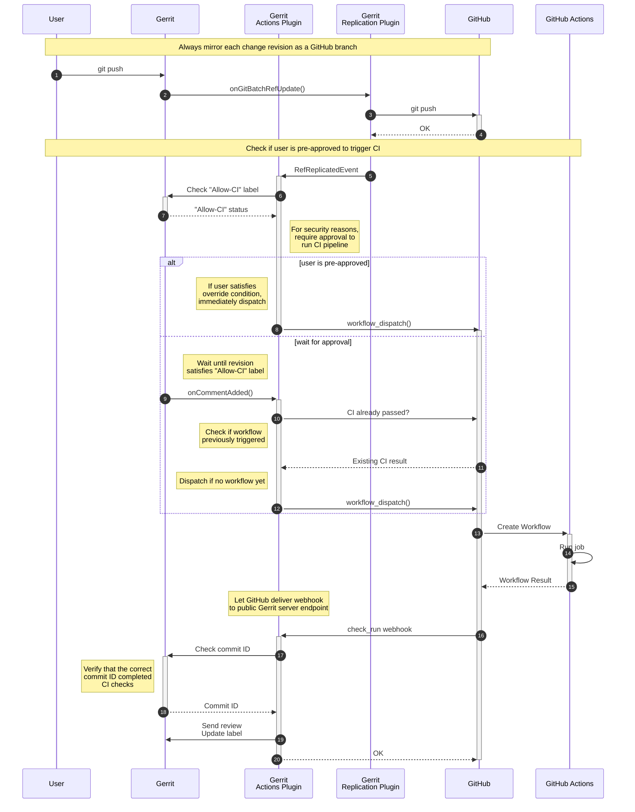

# Gerrit GitHub Actions Plugin

**GitHub Actions integration for Gerrit code review**

## Overview

- [GitHub Actions](https://github.com/features/actions)
  is a continuous integration solution for dispatching code checks on GitHub repos.
- [Gerrit](https://www.gerritcodereview.com/)
  is a powerful code review tool

This tool is intended for Gerrit users that have existing GitHub Actions integrations.

Specifically, it implements the following two tasks.
1. Dispatching GitHub Actions workflows for code changes on Gerrit
2. Updating Gerrit review labels to reflect workflow results

Further info:
- [Security Policy](./SECURITY.md)
- [Internals](./HACK.md)

## Architecture

This module compiles to a Java binary (`.jar`) to be loaded as a Gerrit plugin.

On load, the module registers listeners for various Gerrit events.
It also injects a HTTP servlet exposing a handler for GitHub webhooks.

## Installation

### Build

Build the plugin from source.

This requires
- JDK
- an installation of Bazel 6.0 or greater, or Bazelisk (preferred)
- an Internet connection to fetch build scripts from GitHub and dependencies from Maven

```shell
bazel build //:plugin
```

### Plugin

Copy plugin file to your Gerrit installation.

```shell
# Change path to your Gerrit installation
export GERRIT_SITE=~/gerrit_testsite

# Copy plugin file
cp -L ./bazel-bin/github-actions_deploy.jar "$GERRIT_SITE"/plugin/github-actions.jar
```


## Usage

### Gerrit Reviews

Gerrit Reviews are analogous to GitHub Pull Requests.

Gerrit specifically tracks each _revision_ of a review.
CI status checks are implemented at this revision granularity.

### Gerrit Labels

This plugin interfaces with Gerrit by reading and writing [Review Labels](https://gerrit-review.googlesource.com/Documentation/config-labels.html).

Specifically, there 
- The "Allow-CI" label is _read_ to check whether code changes are permitted to run in CI.
  - `-1` to explicitly forbid CI runs
  - `0` for default behavior (forbid CI runs)
  - `1` to allow CI runs
- The "CI-Result" label is _written_ to reflect the latest status.
  - `-1` on workflow failure
  - `0` if no workflow has been triggered yet (default), or 
  - `+1` on workflow success
  - `+2` as a user override (e.g. CI false negative)

By itself, labels are simply annotations without any effects.
Gerrit admins would use [_Submit Requirements_](https://gerrit-review.googlesource.com/Documentation/config-submit-requirements.html)
to define policies when users are allowed to merge changes.

A common submit requirement would be `label:CI-Result>=+1`.

### Worklow Dispatch

Your GitHub Actions will need to know where your code resides in order to test it.

Gerrit will provide the following inputs.
- `gerrit_repo`: Name of the Gerrit repository (e.g. `my-repo`)
- `gerrit_target_branch`: Name of the target branch (e.g. `main`)
- `gerrit_ref`: Git ref of the change (e.g. `refs/changes/1/2/3)

The code to be tested is then usually sourced via the [`checkout` action](https://github.com/actions/checkout).

Where the code is sourced from depends on your setup.

**Source: Pull**

In a pull setup, the `checkout` action is configured to clone the project repo directly from Gerrit.
The commit to be tested is checked out based on input data.

This is the simplest setup, as it doesn't require any additional plugins.

However, the GitHub Actions CI config (YAML files) will still have to reside in the GitHub repo at which the workflows are dispatched (separate from Gerrit).

**Source: Replication**

Alternatively, you can configure Gerrit to asynchronously replicate all code reviews to a GitHub repo.
You will need to set up the `replication` plugin for this.

## Logic

The following sequence diagram illustrates the full flow with a replication source.



## Config Reference

The easiest way to update your config is to re-run the Gerrit install wizard.

Alternatively, you can edit config files directly as follows.

### Server Config

Add GitHub secrets to your `secret.config` file.

```shell
cat <<'EOF' >> "$GERRIT_SITE"/etc/gerrit.config
[plugin "github-actions"]
  github-origin = github.com
  app-id = ...
  private-key-file = ...
EOF

cat <<'EOF' >> "$GERRIT_SITE"/etc/secret.config
[plugin "github-actions"]
  webhook-secret = ...
EOF
```

### Project Config

Project-specific config is located at the `refs/meta/config` Git ref.

```shell
# Checkout project config
git fetch gerrit refs/meta/config
git checkout FETCH_HEAD

# Add project-specific config
cat <<'EOF' >> ./project.config
[plugin "github-actions"]
  owner = firedancer-io
  repo = firedancer-ci
  workflow = test
  workflow-ref = main
EOF

# Commit config change
git add ./project.config
git commit

# Open change request for config change
git push gerrit HEAD:refs/for/refs/meta/config
```
